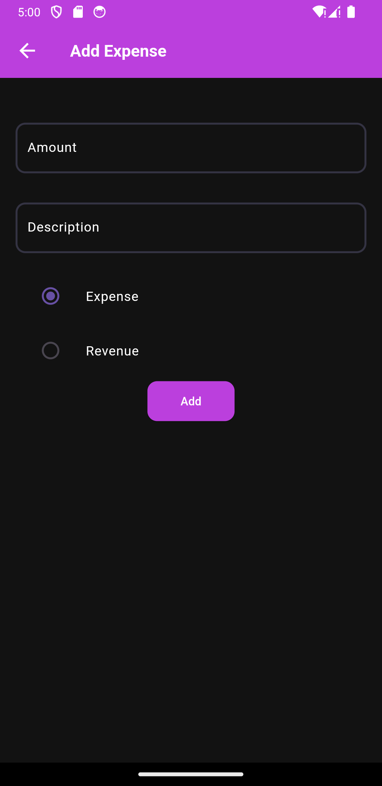
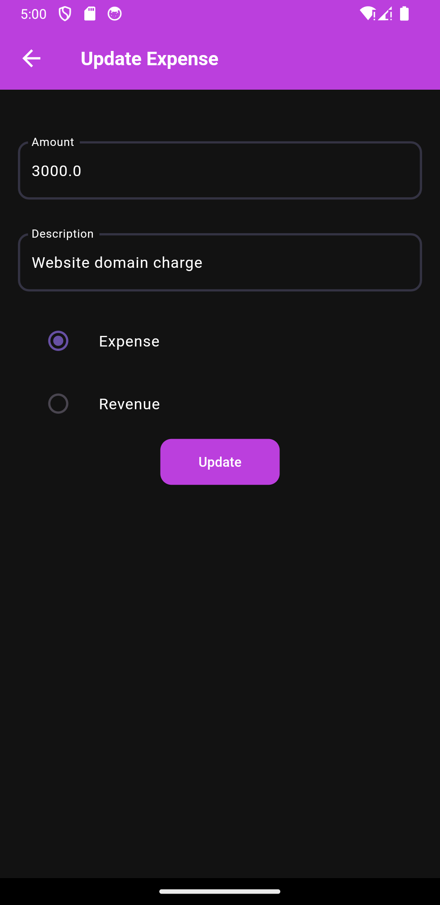
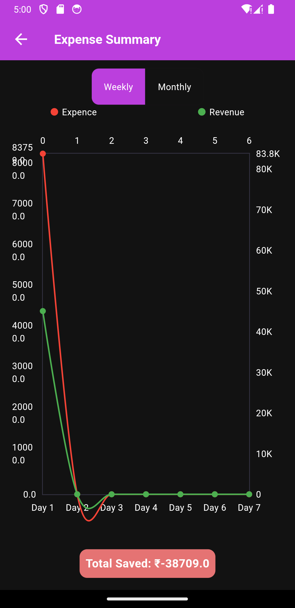

# Personal Expense Tracker


## Description

Personal Expense Tracker is a mobile application built using Flutter that helps you manage your expenses efficiently. The app allows you to add, view, edit, and delete expenses, view expense summaries, set reminder notifications, and more. It supports multiple languages and provides an intuitive and visually appealing user interface with advanced animations. 

### Key Features

- **Add, View, Edit, and Delete Expenses**: Easily manage your expenses with a user-friendly interface.


- **Expense Summaries**: Get a quick overview of your spending with detailed summaries.

- **UI Animations**: Smooth and engaging animations enhance user experience while adding expence.
- **Provider for State Management**: Efficient state management using Provider.
- **Hive for Data Persistence**: Local data storage using Hive.
- **MVVM Architecture**: Organized and maintainable codebase following MVVM principles.
- **Unit Testing**: High code quality ensured through thorough unit testing.

## Technologies Used

- **Flutter**: For building the mobile application.
- **Provider**: For state management.
- **Hive**: For local data persistence.

### Installation

   ```sh
   1. flutter pub get
   2. flutter run